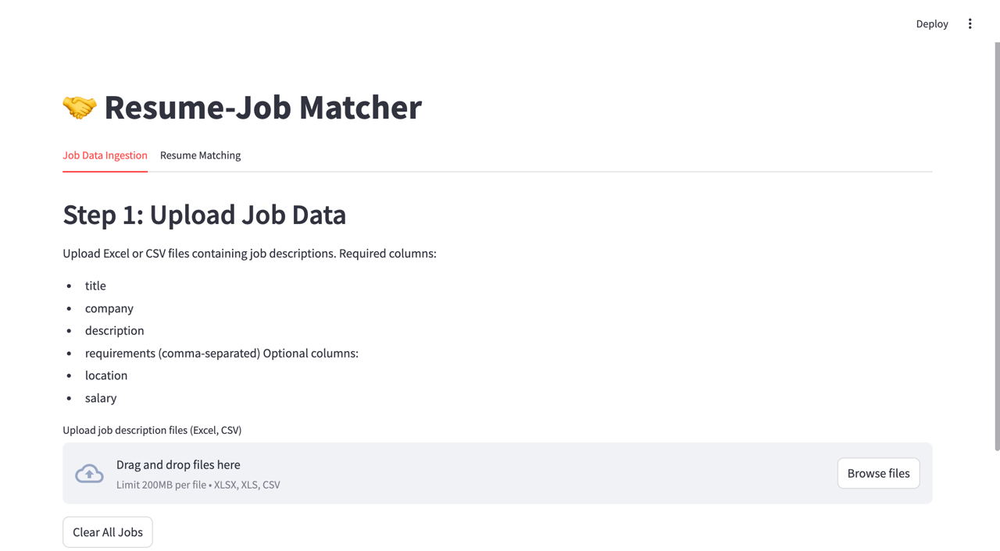
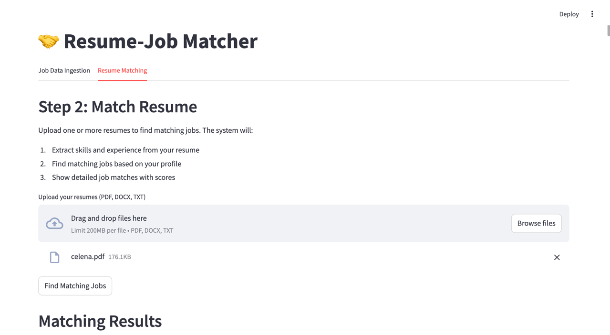
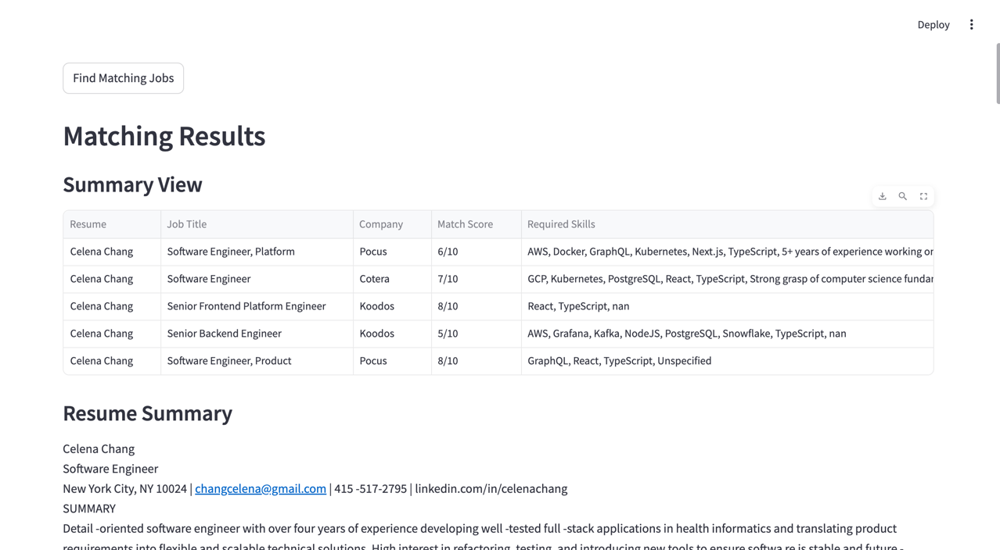

# Resume-Job Matcher 🤝

A powerful application that matches resumes with job descriptions using AI-powered semantic analysis and scoring. The system processes both job listings and resumes to find the most relevant matches based on skills, experience, and requirements.



## Features

### 1. Job Data Ingestion
- Upload Excel or CSV files containing job descriptions
- Required columns:
  - title
  - company
  - description
  - requirements (comma-separated)
- Optional columns:
  - location
  - salary
- Bulk processing of multiple job files
- Clear all jobs functionality
- File size limit: 200MB per file

### 2. Resume Matching
- Support for multiple resume formats (PDF, DOCX, TXT)
- Automated skill and experience extraction
- AI-powered matching algorithm
- Detailed match scoring and analysis
- Bulk resume processing capability
- File size limit: 200MB per file

## Technical Architecture

### Core Components

1. **Main Application (`app.py`)**
   - Streamlit-based web interface
   - File upload handling
   - Process orchestration
   - Results visualization

2. **Resume Processing (`src/resume_processor.py`)**
   - Resume parsing and text extraction
   - Skills and experience identification
   - Document embedding generation

3. **Job Processing (`src/job_processor.py`)**
   - Job description parsing
   - Requirements extraction
   - Data validation

4. **Vector Store (`src/vector_store.py`)**
   - Pinecone integration for vector similarity search
   - Job and resume embedding storage
   - Efficient matching queries

5. **Match Scoring (`src/match_scorer.py`)**
   - Detailed match analysis
   - Score calculation
   - Match justification generation

6. **Data Models (`src/models.py`)**
   - Resume and Job data structures
   - Data validation

### Technology Stack

- **Frontend**: Streamlit
- **Backend**: Python
- **Vector Database**: Pinecone
- **File Processing**: pandas, python-docx, PyPDF2
- **AI/ML**: OpenAI embeddings
- **Environment Management**: python-dotenv

## Getting Started

1. Clone the repository
2. Install dependencies:
   ```bash
   pip install -r requirements.txt
   ```
3. Set up environment variables in `.env`:
   ```
   OPENAI_API_KEY=your_openai_api_key
   PINECONE_API_KEY=your_pinecone_api_key
   PINECONE_ENVIRONMENT=your_pinecone_environment
   ```
4. Run the application:
   ```bash
   streamlit run app.py
   ```

## Usage

### Step 1: Job Data Ingestion
1. Navigate to the "Job Data Ingestion" tab
2. Upload Excel/CSV files containing job descriptions
3. Click "Process Job Files" to ingest the data
4. Use "Clear All Jobs" to reset the job database if needed

### Step 2: Resume Matching
1. Navigate to the "Resume Matching" tab
2. Upload one or more resumes
3. Click "Find Matching Jobs"
4. View detailed matching results including:
   - Match scores
   - Company and position details
   - Required skills
   - Match justification
   - Areas for improvement

## Screenshots

### Job Data Ingestion


### Resume Matching


## License

This project is licensed under the MIT License - see the LICENSE file for details.

## Contributing

Contributions are welcome! Please feel free to submit a Pull Request.

## Support

For support, please open an issue in the GitHub repository.